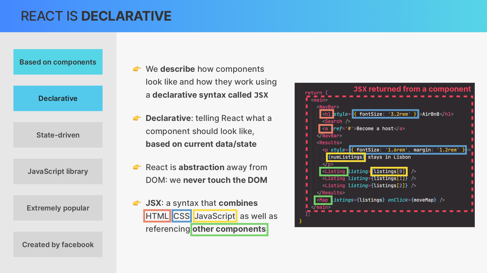
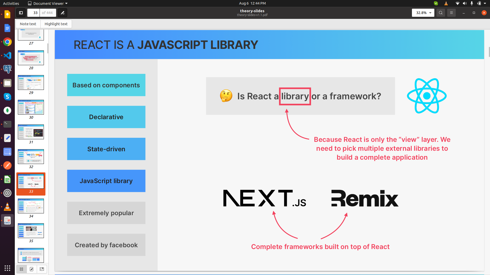
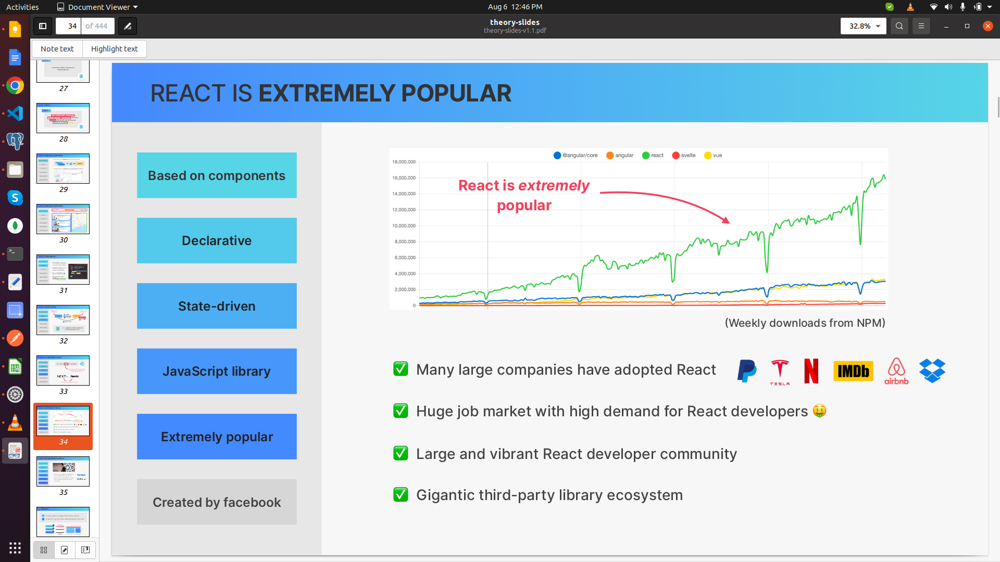

### Useful Resources for Part 1

Here are some resources that you might find helpful while studying Part 1.

👉 [React](https://react.dev/?ref=jonas.io) (Documentation that you should keep open at all times)

👉 [Create React App](https://create-react-app.dev/?ref=jonas.io) (This is how we'll set up our first app)

👉 [Vite:](https://vitejs.dev/guide/?ref=jonas.io) Getting Started (For real-world React apps)

👉 [Adding React URL to an HTML Document](https://gist.githubusercontent.com/gaearon/0275b1e1518599bbeafcde4722e79ed1/raw/db72dcbf3384ee1708c)

### First Look at React

1. **Why Do Front-End Frameworks Exist?**

JavaScript front-end frameworks exist because keeping a user interface in sync with data is challenging and requires a lot of work. These frameworks, such as React, Angular, and Vue, alleviate this burden from developers by managing the complexity of state and UI synchronization.

2. **React vs. Vanilla JavaScript**

- **React is a JavaScript library for building user interfaces.**
  - **Component-Based:** Components are the building blocks of a user interface in React.
  - **Declarative:** React uses a declarative approach, making code more predictable and easier to debug.
  - **State-Driven:** React renders components on a webpage UI based on their current state, and it keeps the UI in sync with state changes by re-rendering (reacting) as the state updates.
  - **Extremely Popular:** React is widely used and has a large community, providing extensive resources and support.

1 Rendering components on a webpage UI based on their current state
2 Keeping the UI in sync with state, by re-rendering (reacting) when state changes
