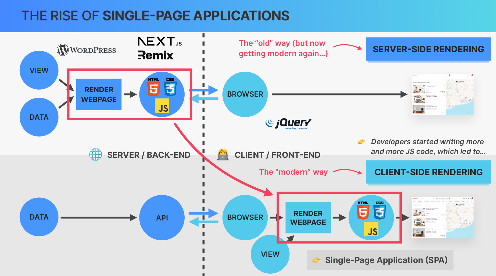

Useful Resources for Part 1

Here are some resources that you might find helpful while studying this Part 1.

👉 [React](https://react.dev/?ref=jonas.io) (Documentation that you should keep open at all times)

👉 [Create React App](https://create-react-app.dev/?ref=jonas.io) (This is how we'll setup our first app)

👉 [Vite:](https://vitejs.dev/guide/?ref=jonas.io) Getting Started (For real-world React apps)

👉 [Adding React URL to an HTML Document](https://gist.githubusercontent.com/gaearon/0275b1e1518599bbeafcde4722e79ed1/raw/db72dcbf3384ee1708c4a07d3be79860db04bff0/example.html) (For the "Pure React" lecture)

There will be a lot more resources in the other parts. If you have additional suggestions, please add them to the Q&A of this lecture.

First look at react

1.Why do front end framework exists?

JavaScript front-end framework exits because of
Keeping a User interface in sync with data is really hard and lot of work

front-end frameworks will solve this problem and take hard work away from developers

frameworks are like react , angular vue ....etc

2.React vs Vanilla JavaScript

React is Javascript library for building user interface

Based on components

components are building blocks of user interface in react

Declarative

State Driven

Javascript library

Extremely Popular
