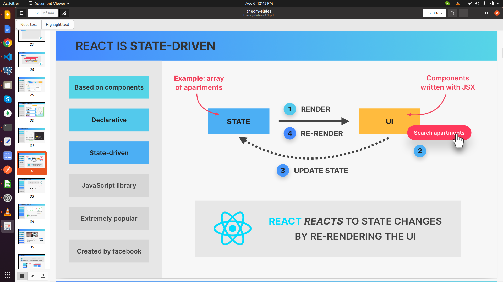

### Useful Resources for Part 1

Here are some resources that you might find helpful while studying Part 1.

👉 [React](https://react.dev/?ref=jonas.io) (Documentation that you should keep open at all times)

👉 [Create React App](https://create-react-app.dev/?ref=jonas.io) (This is how we'll set up our first app)

👉 [Vite:](https://vitejs.dev/guide/?ref=jonas.io) Getting Started (For real-world React apps)

👉 [Adding React URL to an HTML Document](https://gist.githubusercontent.com/gaearon/0275b1e1518599bbeafcde4722e79ed1/raw/db72dcbf3384ee1708c)

### First Look at React

1. **Why Do Front-End Frameworks Exist?**

JavaScript front-end frameworks exist because keeping a user interface in sync with data is challenging and requires a lot of work. These frameworks, such as React, Angular, and Vue, alleviate this burden from developers by managing the complexity of state and UI synchronization.

2. **React vs. Vanilla JavaScript**

- **React is a JavaScript library for building user interfaces.**
  - **Component-Based:** Components are the building blocks of a user interface in React.
  - **Declarative:** React uses a declarative approach, making code more predictable and easier to debug.
  - **State-Driven:** React renders components on a webpage UI based on their current state, and it keeps the UI in sync with state changes by re-rendering (reacting) as the state updates.
  - **Extremely Popular:** React is widely used and has a large community, providing extensive resources and support.





1 Rendering components on a webpage UI based on their current state
2 Keeping the UI in sync with state, by re-rendering (reacting) when state changes

### Pure React

For a pure React setup, you can start with the official [React documentation](https://react.dev).

#### Basic HTML Structure with React

Add these script links to your HTML file to include React and ReactDOM:

```html
<!DOCTYPE html>
<html lang="en">
  <head>
    <meta charset="UTF-8" />
    <meta name="viewport" content="width=device-width, initial-scale=1.0" />
    <title>Document</title>
  </head>
  <body>
    <script src="https://unpkg.com/react@18/umd/react.development.js"></script>
    <script src="https://unpkg.com/react-dom@18/umd/react-dom.development.js"></script>
  </body>
</html>
```

#### Example: Pure React Application

Here's an example of a simple React application embedded in an HTML file:

```html
<!DOCTYPE html>
<html lang="en">
  <head>
    <meta charset="UTF-8" />
    <meta name="viewport" content="width=device-width, initial-scale=1.0" />
    <title>Pure React</title>
  </head>
  <body>
    <!-- root is standard in React -->
    <div id="root"></div>
    <script src="https://unpkg.com/react@18/umd/react.development.js"></script>
    <script src="https://unpkg.com/react-dom@18/umd/react-dom.development.js"></script>
    <!-- Don't use this in production: -->
    <script src="https://unpkg.com/@babel/standalone/babel.min.js"></script>
    <script>
      function App() {
        const [time, setTime] = React.useState(new Date().toLocaleTimeString());
        React.useEffect(() => {
          const intervalId = setInterval(() => {
            setTime(new Date().toLocaleTimeString());
          }, 1000);
          return () => clearInterval(intervalId); // Clean up the interval on unmount
        }, []);
        return React.createElement("header", null, `Hello React! ${time}`);
      }
      const root = ReactDOM.createRoot(document.getElementById("root"));
      root.render(React.createElement(App));
    </script>
  </body>
</html>
```

This example creates a simple React application that displays the current time and updates every second. The `App` component uses React hooks (`useState` and `useEffect`) to manage and update the state.
