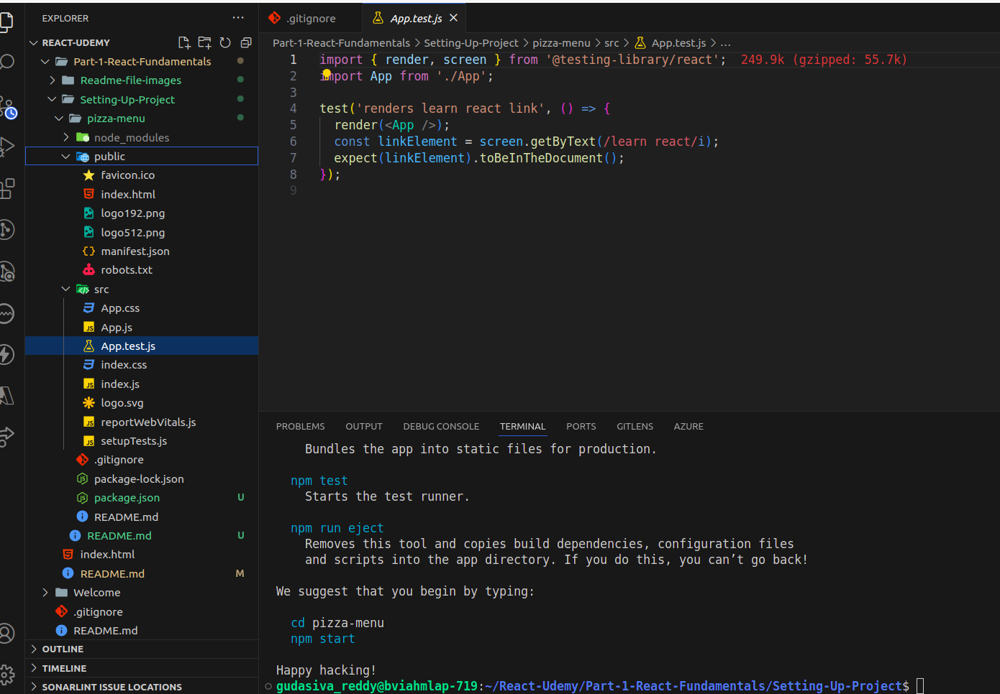

### Creating a New React App: Pizza Menu

To create a new React app for a pizza menu, run the following command in your terminal:

```bash
npx create-react-app@5 pizza-menu
```

Using `create-react-app@5` ensures that you are specifically using version 5 to create your project.

you will get this files

